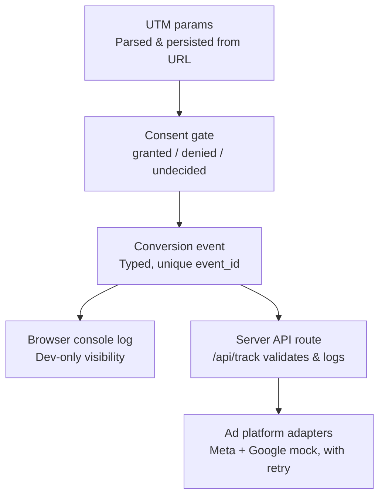

# Privacy-Aware Conversion Tracking

A consent-aware conversion tracking starter kit built with Next.js and TypeScript. This project explores how to capture, gate, and structure marketing attribution data (UTM parameters, conversion events) in a way that respects user consent by default — nothing is tracked until a visitor explicitly opts in.

## Demo


**Status: complete.** All planned features for this project are built, tested, and documented.

## Why this exists

Most marketing sites fire tracking scripts the moment a page loads, often before a visitor has said anything about consent. This project takes the opposite default: tracking infrastructure exists, but nothing captures or persists data until consent is explicitly granted — and that gate is enforced at the lowest level, not bolted on as an afterthought.

## What's built so far

- **UTM capture** (`src/lib/utm.ts`) — parses campaign parameters (`utm_source`, `utm_medium`, `utm_campaign`, `utm_content`, `utm_term`) from the URL and persists them across page visits using a last-touch model.
- **Consent handling** (`src/lib/consent.ts`) — tracks consent as `"granted" | "denied" | "undecided"`, persisted and reactive across the app via a custom hook (`useConsentStatus`). Denying consent blocks new capture; it does not retroactively erase data already captured while consent was granted.
- **Typed event schema** (`src/lib/events.ts`) — a discriminated union of conversion event types (`page_view`, `campaign_landing`, `signup_started`, `signup_completed`), each carrying a unique `event_id` (for future deduplication), an ISO 8601 timestamp, and a snapshot of captured UTM data at creation time.
- **Dev debug panel** (`src/components/UtmDebugPanel.tsx`) — a dev-only overlay for manually inspecting and toggling consent/UTM state during local testing. Excluded from production builds.

All of the above is unit tested with [Vitest](https://vitest.dev/).

## Architecture



## Development history

- [x] Wire event creation into consent-gated tracking calls
- [x] Browser + server conversion events sharing a common `event_id`, for deduplication
- [x] Mock Meta CAPI / Google Enhanced Conversions adapters
- [x] Retry and failure handling for event delivery
- [x] Architecture diagram
- [x] Demo GIF

## Getting started

```bash
npm install
npm run dev
```

Open [http://localhost:3000](http://localhost:3000). Add campaign parameters to the URL to see capture in action, e.g.:

```
http://localhost:3000/?utm_source=newsletter&utm_medium=email&utm_campaign=fall_sale
```

The dev debug panel (bottom-right corner, non-production only) shows live consent status and captured UTM values.

## Running tests

```bash
npm test
```

## Design decisions worth knowing

- **Last-touch attribution.** New UTM params overwrite previously captured ones. First-touch (never overwrite) is a common alternative some attribution setups use instead — not implemented here, but a reasonable extension.
- **Consent is a gate, not an eraser.** Denying consent stops future capture; it doesn't delete data already captured while consent was granted. Wiping historical data on denial would be a stricter, separate design choice.
- **Events are defined separately from consent gating.** `createConversionEvent` is a pure constructor with no side effects — it doesn't check consent or send anything anywhere. Consent checks happen in the code that calls it, keeping "what does an event look like" separate from "is this event allowed to fire."

## Known limitations

- If a visitor navigates away before responding to a consent prompt, UTM parameters present in the URL at that moment are not cached for later — they're only captured if consent is already granted while they're still in the URL. Caching pre-consent data for later use would be a meaningfully different privacy tradeoff than what's implemented here.
